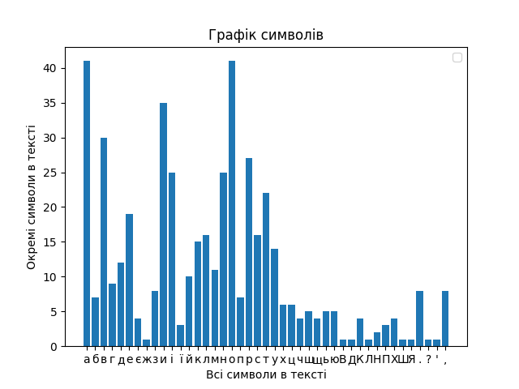
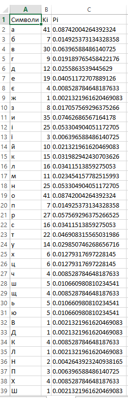

# Character_counter
### This program was created for count character in different texts.

**Firstly**, 
what we need, that put text to the **example.txt** file. 
Then you need to add all characters which you need to count to the **CHARACTER_LIST**

After that need to install **[matplotlib](https://matplotlib.org/stable/contents.html)** library for success running program, because
program use this library for drawing graphics.

**Secondly**, we open ***main.py*** file and run it.

After running program show you window with graphics:

### And

The program will create an EXCEL file with a table that will show you how  
many characters are in the text and their percentage:

